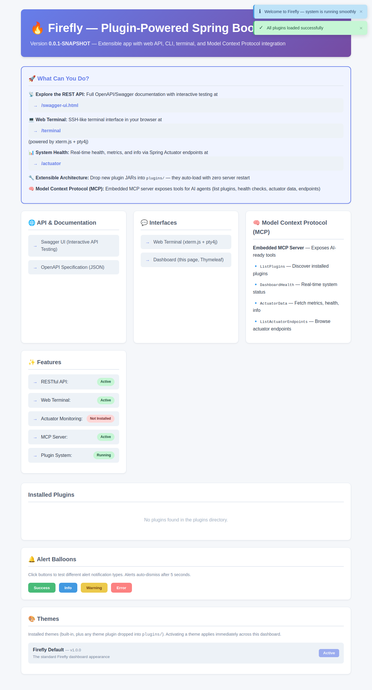
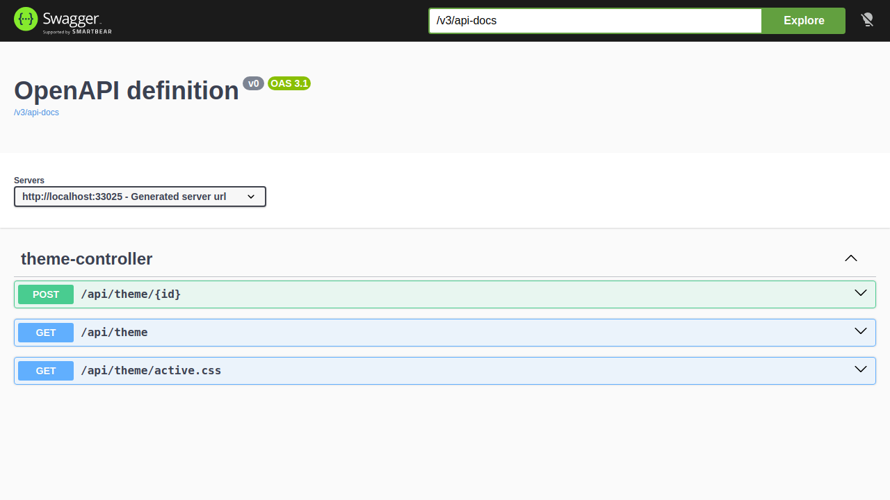
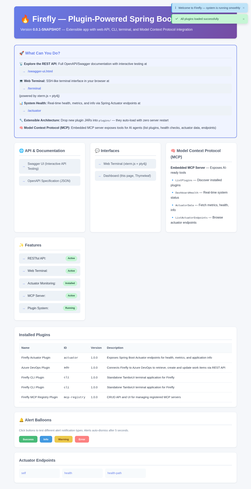
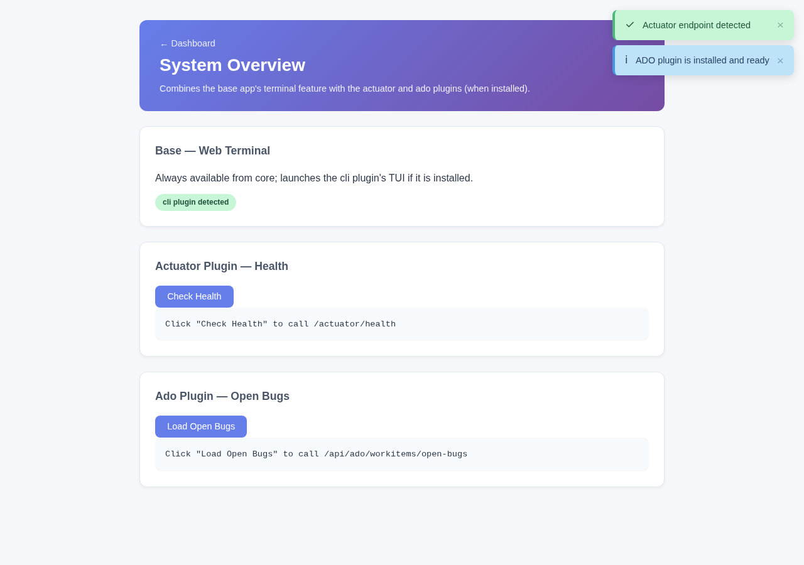
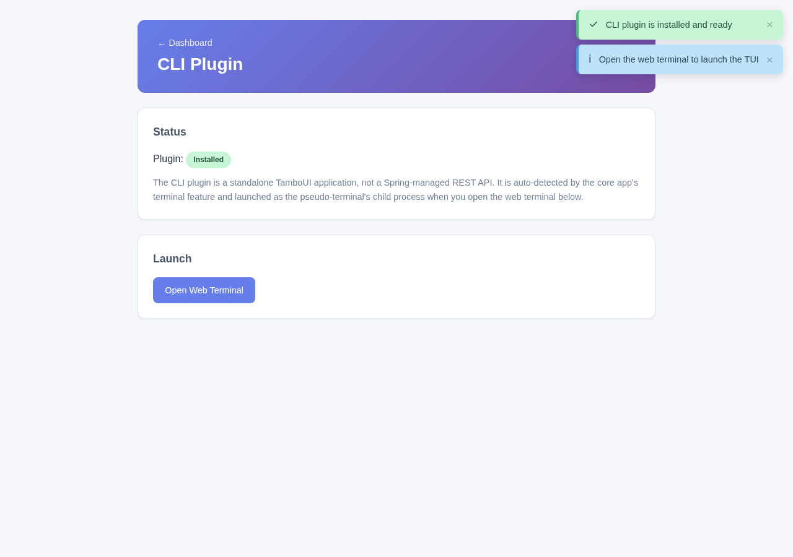
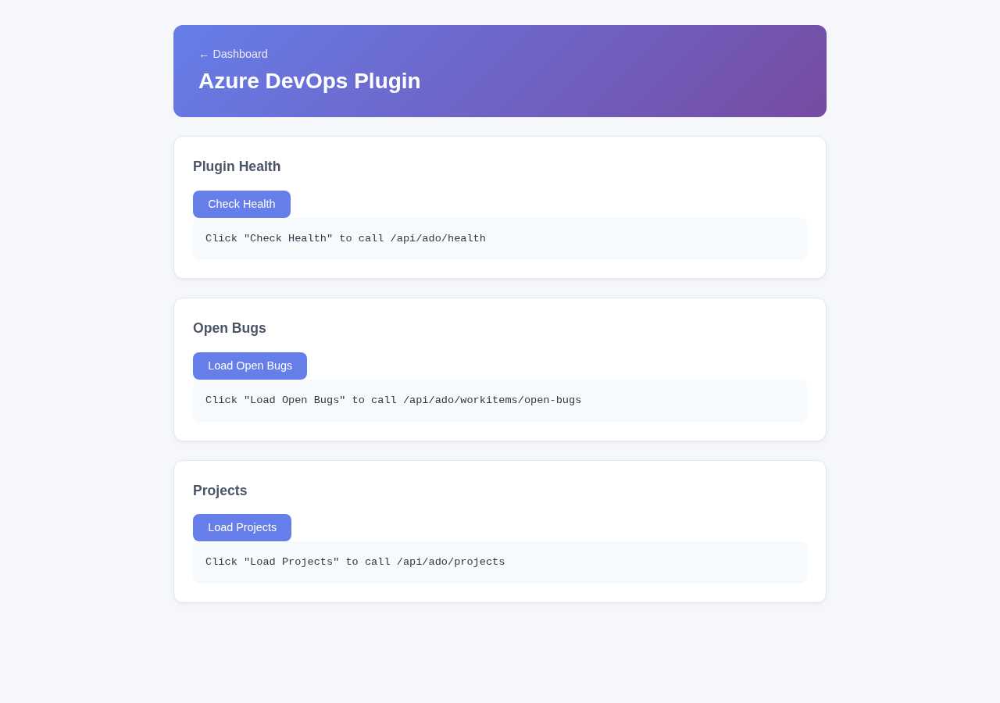
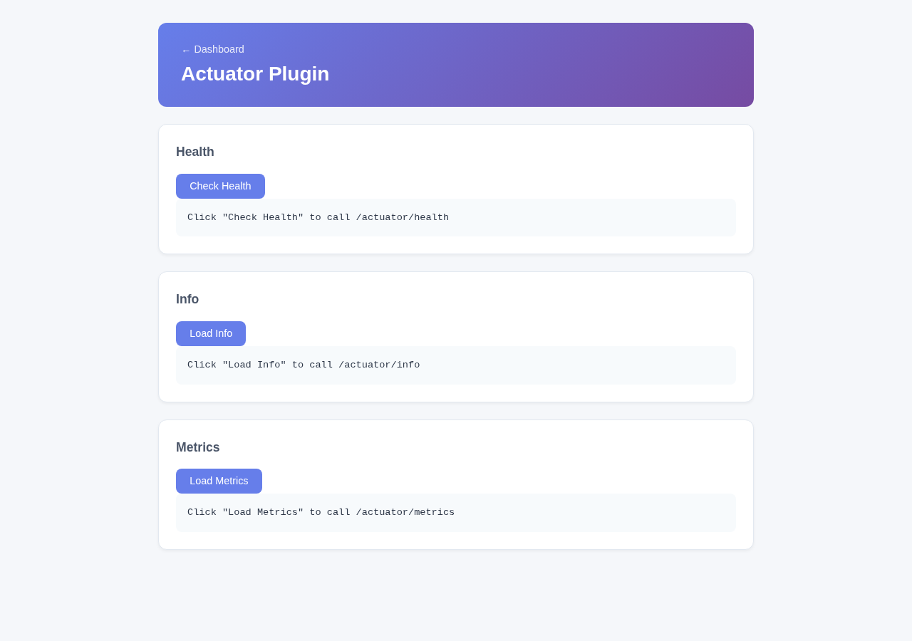
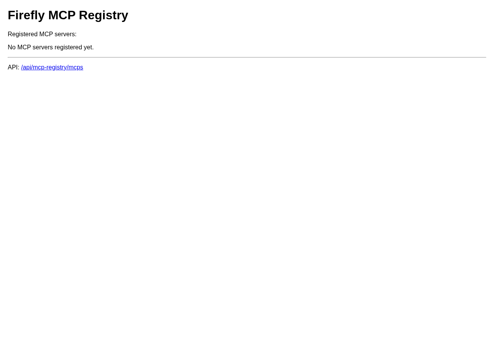

# Firefly

Plugin-powered Spring Boot platform with web dashboard, terminal UI, REST API, OpenAPI docs, system health monitoring, a pluggable theme system, and Model Context Protocol (MCP) integration for AI agents.

**Live Demo:** Start the app and visit:
- **Dashboard** → `http://localhost:17922`
- **Terminal UI (TUI)** → `http://localhost:17922/terminal` (3-panel TamboUI interface)
- **Swagger API Docs** → `http://localhost:17922/swagger-ui.html`
- **Actuator Health** → `http://localhost:17922/actuator`

---

## UI Preview

> The first set below is auto-generated by the [Playwright doc-screenshot system](#auto-documentation-screenshots) on every test run and committed here. The second set is captured manually against a live `app-all-plugins` instance (`docker compose --profile showcase up app-all-plugins --build`) — plugin-contributed pages and controllers only exist once their JAR is loaded via `PropertiesLauncher` at runtime, which the JUnit-embedded test server can't do (plugins are separate Maven projects, not on the core app's test classpath). See [Auto-Documentation Screenshots](#auto-documentation-screenshots) for the full explanation.

### Core app (no plugins)

#### Dashboard



*Root page (`/`) — with no plugin JARs present, the plugin panel correctly reports none found.*

#### Swagger UI



*OpenAPI explorer (`/swagger-ui/index.html`) — always available, no plugin required.*

#### Web Terminal


*xterm.js terminal (`/terminal`) — connects via WebSocket to a PTY session. With no `cli-plugin` JAR present, `TerminalService` falls back to a bare `java` process, shown here.*

### With all plugins loaded (`app-all-plugins` / showcase)

#### Dashboard



*Same `/` page with all 4 plugin JARs baked in — the Installed Plugins table now lists actuator, ado, cli, and mcp-registry, and Actuator Monitoring flips to detected.*

#### System Overview



*`/pages/overview` — combines the core terminal feature with live actuator and ADO plugin calls.*

#### CLI Plugin page



*`/pages/cli` — confirms the CLI plugin is installed and links to the terminal.*

#### Azure DevOps Plugin page



*`/pages/ado` (`ado-plugin`) — health check, open bugs, and project listing against Azure DevOps.*

#### Actuator Plugin page



*`/pages/actuator` (`actuator-plugin`) — health, info, and metrics from Spring Boot Actuator.*

#### MCP Registry page



*`/mcp-registry` (`mcp-registry-plugin`) — CRUD UI for registered MCP servers.*

#### Web Terminal — real TUI


*`/terminal` with `cli-plugin` actually loaded — the WebSocket PTY session launches the real TamboUI: file explorer, status panel (Java/OS/user/PID), menu bar, and output log.*

---

## Quick Start

### Prerequisites

- Docker & Docker Compose — the supported way to build, run, and test this project
- (Optional, local-only alternative) Java 25 + Maven 3.9+ / `./mvnw`, GraalVM CE 25.0.2 for native builds — only if your host JDK matches the project's toolchain

## Building, Running, and Testing

### Option 1: Docker Compose (recommended)

```bash
# Build everything
./scripts/build.sh

# Run the app
docker compose up app --build
```

Or step-by-step:
```bash
# Build the core app (runs unit tests as part of `mvn install`)
docker compose --profile build run --rm app-build

# Build all plugins
docker compose --profile build run --rm plugin-build

# Run the app (exposes port 17922)
docker compose up app --build
```

**First run only:** Plugins must be built and copied to `plugins/` directory. The build script does this automatically.

The application is exposed on **port 17922**. See `AGENTS.md` for full Compose profile reference (build/verify/plugin/showcase/native).

### Option 2: Maven (JVM) — local alternative

```bash
./mvnw clean package
./target/firefly-*.jar     # directly executable, or: java -jar target/firefly-*.jar
```

The application will start on **port 17922**.

### Option 3: Maven (Native Image) — local alternative

Requires GraalVM CE 25.0.2 (`JAVA_HOME` must point at it — `asdf` users: `JAVA_HOME=$(asdf where java)`):

```bash
JAVA_HOME=$(asdf where java) ./mvnw -Pnative native:compile -DskipTests
./target/firefly
```

Or build inside Docker (no local GraalVM needed; targets whatever platform Docker runs on):

```bash
docker compose --profile native run --rm native-build
./target/firefly
```

Native image starts in ~61ms.

### MCP Registry Plugin

Registers external MCP servers, and groups plugin-contributed skills/MCP-server definitions into a tree (any plugin can bundle a `META-INF/firefly/mcp-plugin.json` manifest — see `actuator-plugin`, `ado-plugin`, `plantuml-plugin`, `markdown-plugin` for examples).

**Build (Docker):**
```bash
docker compose --profile build run --rm plugin-build
```

**Endpoints exposed when plugin is active:**
| Endpoint | Method | Description |
|----------|--------|-------------|
| `/api/mcp-registry/mcps` | GET/POST | List/register external MCP servers |
| `/api/mcp-registry/mcps/{id}` | GET/DELETE | Get/remove a registered MCP server |
| `/api/mcp-registry/tree` | GET | Plugin-contributed skills/servers, grouped by plugin |
| `/api/mcp-registry/tree/{pluginId}/config` | GET | Resolved config for one plugin's tree node (secrets masked) |
| `/mcp-registry` | GET | Web UI — registered servers + the expandable plugin tree with a Settings panel |

See `AGENTS.md` § MCP Registry Plugin for the manifest format and full detail.

### Theme Manager + Theme Plugins

Core-owned theme system (not a plugin) that discovers **theme plugins** — JARs bundling a `META-INF/firefly/theme.css` override, no Java code required — and serves the active one's CSS at `/api/theme/active.css`, linked from the dashboard so switching themes needs no rebuild. `midnight-theme-plugin` ships as a working example. Activate from the dashboard's "🎨 Themes" card, or `POST /api/theme/{id}`. See `AGENTS.md` § Theme Manager for the CSS custom-property contract.

### PlantUML Plugin

Bundles PlantUML and renders diagram source to SVG/PNG — no external PlantUML/Graphviz install needed.

**Build (Docker):** `docker compose --profile build run --rm plugin-build`

| Endpoint | Method | Description |
|----------|--------|-------------|
| `/api/plantuml/render?format=svg\|png` | POST | Render raw PlantUML source (`text/plain` body) to an image |
| `/api/plantuml/health` | GET | Plugin health check |
| `/pages/plantuml` | GET | Web UI — source textarea + live preview |

### Markdown Plugin

Fully functional Markdown file editor scoped to a configured root directory (`firefly.plugin.markdown.root-dir`), with path-traversal-safe file operations.

**Build (Docker):** `docker compose --profile build run --rm plugin-build`

| Endpoint | Method | Description |
|----------|--------|-------------|
| `/api/markdown/files` | GET | List `.md` files under the root |
| `/api/markdown/files/**` | GET/PUT/DELETE | Read/write/delete one file |
| `/api/markdown/preview` | POST | Render raw markdown to HTML |
| `/api/markdown/health` | GET | Plugin health check |
| `/pages/markdown` | GET | Web UI — file tree, editor, live preview |

### WebTUI Browser Plugin

A modern take on the 80s terminal browser (lynx/w3m) — drives headless Chromium server-side (Playwright) and serves the rendered page as a real PNG screenshot, so pages render with actual JS/CSS/images instead of ANSI-art approximations. Degrades gracefully (`browserAvailable: false`, clean 503s) wherever Chromium's native libraries aren't installed, rather than crashing.

**Build (Docker):** `docker compose --profile build run --rm plugin-build`

| Endpoint | Method | Description |
|----------|--------|-------------|
| `/api/webtui/health` | GET | Plugin + browser-availability status |
| `/api/webtui/navigate` | POST | Navigate the shared page (`{"url":...}`) |
| `/api/webtui/screenshot` | GET | Current page as `image/png` |
| `/api/webtui/click` \| `/scroll` \| `/type` \| `/back` \| `/forward` | POST | Drive the page |
| `/pages/webtui` | GET | Web UI — URL bar, live screenshot, click/scroll/type controls |

### Azure DevOps Plugin

The ADO plugin connects Firefly to Azure DevOps for work item management.

**Build (Docker):**
```bash
docker compose --profile build run --rm plugin-build
```

**Build (local Maven alternative):**
```bash
cd plugins/ado-plugin
mvn clean package
```

**Install:**
```bash
cp plugins/ado-plugin/target/ado-plugin-1.0.0.jar plugins/
```

**Configure:** Copy `plugins/ado-plugin.yaml` to `plugins/ado-plugin.yaml` and set your values, or use environment variables:
```yaml
firefly:
  plugin:
    ado:
      enabled: true
      url: https://dev.azure.com/my-org
      project: my-project
      pat: ${ADO_PAT}
```

**Endpoints exposed when plugin is active:**
| Endpoint | Description |
|----------|-------------|
| `GET /api/ado/health` | Plugin connection status |
| `GET /api/ado/workitems/{id}` | Get a work item |
| `POST /api/ado/workitems/query` | Query work items (WIQL) |
| `GET /api/ado/workitems/open-bugs` | Get all open bugs |
| `GET /api/ado/workitems/tasks?user={name}` | Get tasks for user |
| `PATCH /api/ado/workitems/{id}/state` | Update work item state |
| `PATCH /api/ado/workitems/{id}/assign` | Assign work item |
| `POST /api/ado/tasks` | Create a task |
| `POST /api/ado/bugs` | Create a bug |
| `GET /api/ado/projects` | List projects |

## Core Endpoints

| Endpoint | Description |
|----------|-------------|
| `GET /` | Dashboard — installed plugins, system status, quick links |
| `GET /terminal` | Web terminal UI (xterm.js + pty4j) with TUI (TamboUI) |
| `GET /swagger-ui.html` | OpenAPI/Swagger interactive API documentation |
| `GET /v3/api-docs` | OpenAPI specification (JSON) |
| `GET /actuator` | Spring Boot Actuator endpoints (if plugin loaded) |
| `WS /ws/terminal` | WebSocket bridge for terminal PTY |

## Dashboard Info Panel

The dashboard homepage displays:
- **What Can You Do?** — introduction to Firefly capabilities
- **API & Documentation** — links to Swagger UI and OpenAPI JSON
- **Interfaces** — web terminal and dashboard links
- **Model Context Protocol (MCP)** — embedded MCP server exposing 4 AI-ready tools:
  - `ListPlugins` — discover installed plugins
  - `DashboardHealth` — real-time system status
  - `ActuatorData` — fetch metrics, health, info
  - `ListActuatorEndpoints` — browse actuator endpoints
- **Features** — status of REST API, Web Terminal, Actuator, MCP, Plugin System
- **Installed Plugins** — table of loaded plugins with metadata
- **Actuator Endpoints** — clickable endpoints if Actuator plugin is active

## Terminal UI (TUI) — Web-Based 3-Panel Interface

Access at **`http://localhost:17922/terminal`** (runs in your browser).

**Features:**
- **Left Panel (Explorer)** — Browse installed plugins (firefly-core, actuator-plugin, ado-plugin, cli-plugin)
- **Center Panel** — Main content area
- **Right Panel (Status)** — System status indicators
- **Search Mode** (Ctrl+/) — Filter explorer items
- **Menu System** — File, Edit, View menus
- **Toolbar** — RUN, BUILD, TEST, SEARCH actions
- **Output Panel** — Command history (up to 200 lines)
- **Dark Theme Toggle** — Configurable appearance
- **Full Mouse Support** — Click menus, drag, select

Built with **TamboUI** (terminal UI framework) + **picocli** (command-line interface).

---

## Auto-Documentation Screenshots

The test suite includes a global JUnit 5 extension (`src/test/java/ai/firefly/testdoc/ScreenshotDocumentationExtension`) that automatically captures Playwright/Chromium screenshots of every test that boots a real embedded web server — no per-test changes needed. Screenshots are written to `docs/screenshots/` and committed here as living UI documentation.

**Adding a new page to the screenshot set** — annotate your test method with `@DocScreenshot`:
```java
@Test
@DocScreenshot(paths = {"/your-page", "/another-page"})
void myFeatureTest() { ... }
```

Any `@SpringBootTest(webEnvironment = RANDOM_PORT)` test picks up the extension automatically; plain unit tests are silently skipped. See `AGENTS.md § Test Doc Screenshots` for the full design and browser provisioning notes.

**Container gotcha**: inside `maven:3-eclipse-temurin-25` (what `docker compose --profile build run --rm app-build` uses), Playwright's own Chromium download is present but the *OS-level* shared libraries it needs (`libnss3`, `libatk-bridge2.0-0`, etc.) aren't — the extension catches the launch failure and silently skips, so screenshots regenerated through that container are a no-op rather than an error. Install them once per container lifetime before running tests: `./mvnw exec:java -Dexec.mainClass=com.microsoft.playwright.CLI -Dexec.classpathScope=test -Dexec.args=install-deps`.

**Plugin pages and the real TUI aren't reachable this way**: the JUnit extension screenshots pages served by the *core* app's own test classpath. Plugin-contributed routes (`/pages/ado`, `/pages/actuator`, `/mcp-registry`) and a real `cli-plugin` TUI in `/terminal` only exist once those JARs are loaded via `PropertiesLauncher` at runtime — plugins are separate Maven projects, never on the core app's compile/test classpath. The "With all plugins loaded" gallery above was captured by running `docker compose --profile showcase up app-all-plugins --build` and driving a real browser (Playwright, wall-clock waits — `--virtual-time-budget` headless screenshotting doesn't give WebSocket connections enough real time to establish) against `http://localhost:17922` directly. Re-run manually the same way after any change to a plugin's UI.

---

## Project Structure

```
src/main/java/ai/firefly/
├── FireflyApplication.java
├── dashboard/                        # Web dashboard (Thymeleaf)
│   ├── DashboardController.java
│   ├── DashboardService.java
│   └── PluginInfo.java
├── terminal/                         # Web terminal component (xterm.js + pty4j)
│   ├── TerminalAutoConfiguration.java
│   ├── TerminalController.java
│   ├── TerminalProperties.java
│   ├── TerminalService.java
│   └── TerminalWebSocketHandler.java
└── theme/                            # Theme manager (scans plugins/*.jar for theme.css)
    ├── ThemeManager.java
    ├── ThemeController.java
    └── ThemeInfo.java

plugins/
├── cli-plugin/                       # TUI app (tamboui + picocli)
│   └── FireflyCommand.java
├── actuator-plugin/                  # Spring Boot Actuator endpoints
├── ado-plugin/                       # Azure DevOps integration
├── mcp-registry-plugin/              # MCP server registry + plugin skill/server tree
├── midnight-theme-plugin/            # Dark theme (CSS-only, no Java)
├── plantuml-plugin/                  # PlantUML text-to-diagram rendering
├── markdown-plugin/                  # Markdown file editor
└── webtui-plugin/                    # Headless-Chromium terminal browser
```

## Tech Stack

| Layer | Technology |
|-------|-----------|
| Language | Java 25 |
| Framework | Spring Boot 4.0.6 |
| Web Dashboard | Thymeleaf (server-side templates) |
| Terminal UI (TUI) | TamboUI + jline3 + picocli |
| Web Terminal | xterm.js + WebSocket + pty4j |
| AI Integration | Model Context Protocol (MCP) server |
| Native Compilation | GraalVM CE 25.0.2 + native-maven-plugin |
| API Docs | SpringDoc OpenAPI (Swagger UI) |
| Testing | JUnit 5 + Playwright screenshot documentation |

## Configuration

Key settings in `src/main/resources/application.yaml`:

```yaml
server:
  port: 17922
```

## Development

See `AGENTS.md` for detailed agent-oriented documentation, feature roadmap, and coding conventions.

## Releases

Each Maven project here (root `firefly`, plus every `plugins/*-plugin`) is independently versioned and released via `maven-release-plugin`. See [AGENTS.md § Releases](AGENTS.md#releases-maven-release-plugin) for the `release:prepare`/`release:perform` workflow and GitHub Packages deploy setup.
