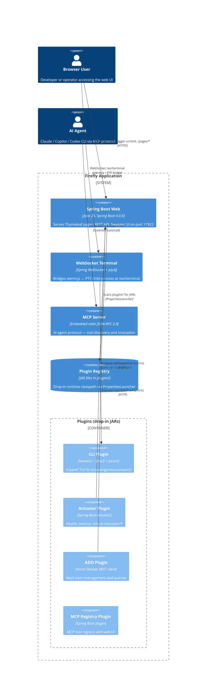
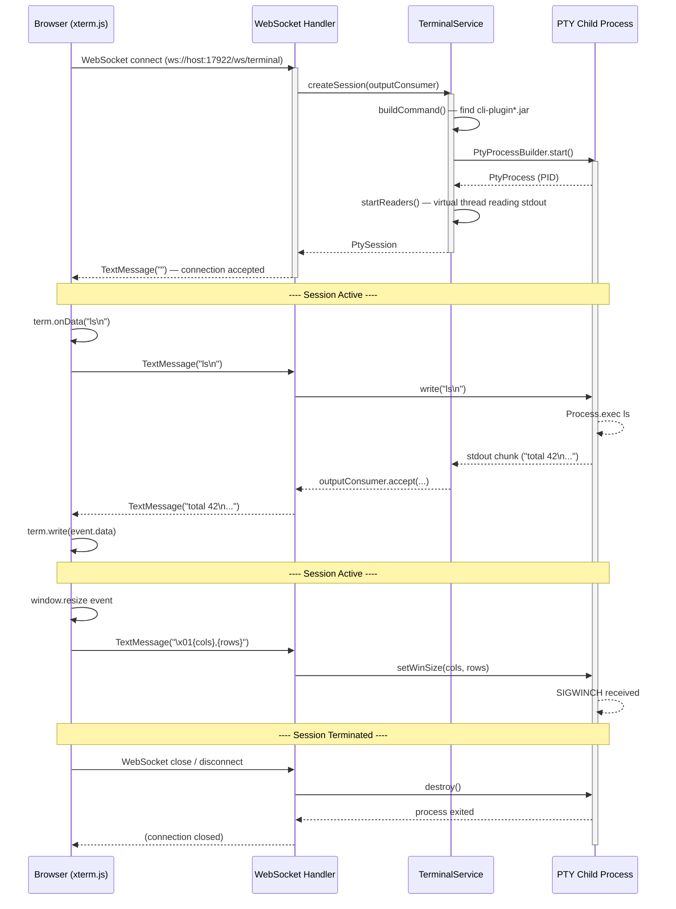
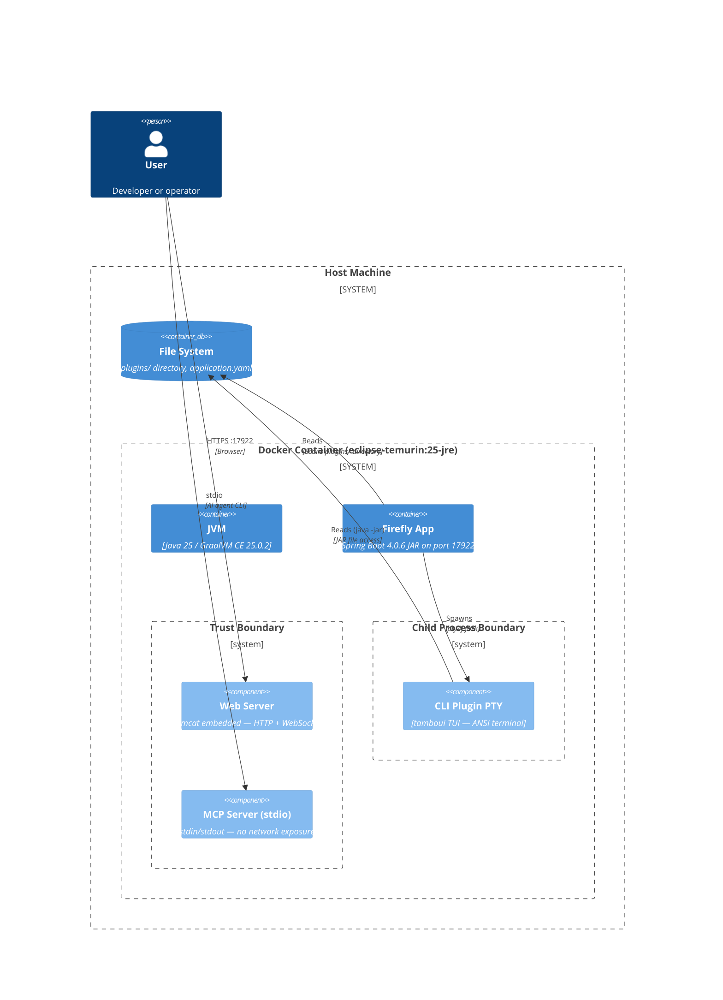
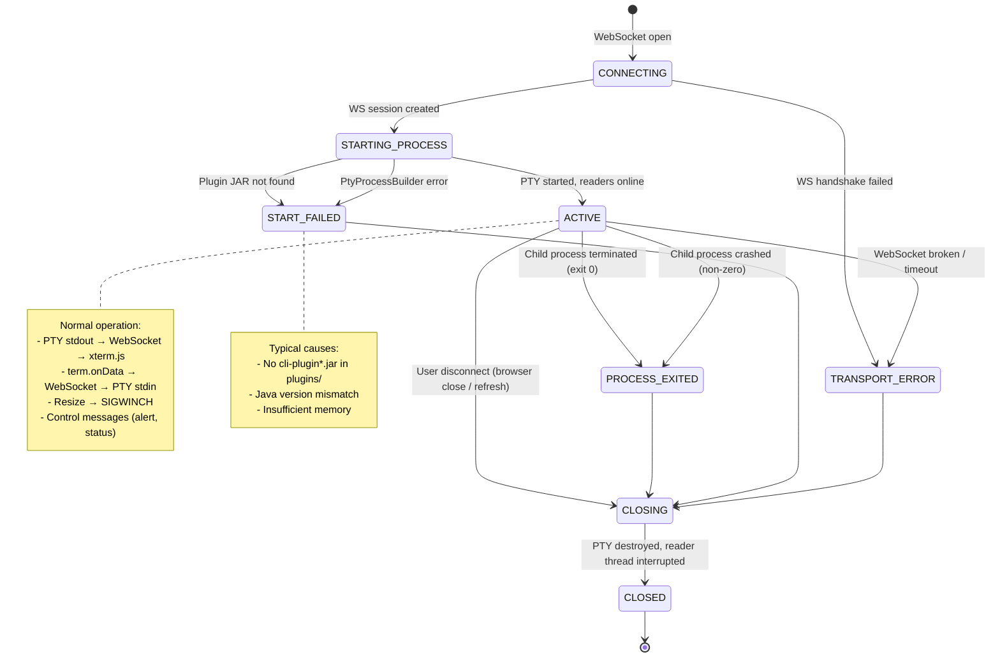
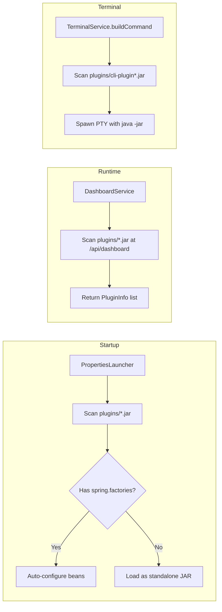

# Firefly — System Architecture

> **Diagram type**: C4 container/component
> **Scope**: Firefly Spring Boot application + plugins
> **Assumption**: Single JVM process, embedded MCP server on stdio
> **Runtime**: Java 25 (GraalVM CE 25.0.2 for native image)
> **Port**: 17922

---

## 1. Container / Component View



---

## 2. Terminal Session — Runtime Sequence



### Terminal WebSocket Protocol

| Direction | Prefix | Payload | Purpose |
|-----------|--------|---------|---------|
| Browser → Server | (none) | Raw text | Terminal input (keystrokes, commands) |
| Browser → Server | `\x01` | `{cols},{rows}` | Terminal resize (e.g. `\x01120,40`) |
| Browser → Server | `\x02` | `{json}` | Control message — alert, status (extensible) |
| Server → Browser | (none) | Raw bytes | PTY output (ANSI + text) |
| Server → Browser | `\x02` | `{json}` | Control message — alert, lifecycle |

**Control message JSON schema:**
```json
{
  "type": "alert",
  "level": "info" | "success" | "warning" | "error",
  "message": "Human-readable message"
}
```

### Invariants

- A WebSocket session owns at most one PTY process.
- Closing the session must terminate the owned process.
- Output may only be sent to the owning browser session.
- Plugin processes may only launch from approved JAR locations.

### Unspecified

- Authentication
- Process sandboxing
- Resource limits
- Reconnection
- Backpressure

---

## 3. Deployment / Trust Boundary



---

## 4. Terminal Session — State Model



---

## 5. Plugin Loading Architecture



---

## 6. Alert System Architecture

```mermaid
flowchart LR
  subgraph Server
    C[Controller] -->|model.addAttribute alerts| T[Thymeleaf]
    W[WebSocket Handler] -->|\\x02 JSON control msg| F[Frontend JS]
  end

  subgraph Client
    T -->|th:replace fragments/alert| H[alert.html fragment]
    F -->|fireflyShowAlert()| H
    H -->|auto-dismiss 5s| U[User sees balloon]
  end

  subgraph Alert Types
    S[success - green]
    I[info - blue]
    W2[warning - yellow]
    E[error - red]
  end
```

---

## Directory Structure

```
src/main/java/ai/firefly/
├── FireflyApplication.java
├── dashboard/           # Web dashboard — Thymeleaf + REST
│   ├── DashboardController.java
│   ├── DashboardService.java
│   ├── PluginInfo.java
│   ├── AlertMessage.java         ← NEW
│   ├── OverviewPageController.java
│   └── CliPageController.java
├── terminal/            # Web terminal — WebSocket + pty4j
│   ├── TerminalAutoConfiguration.java
│   ├── TerminalController.java
│   ├── TerminalProperties.java
│   ├── TerminalService.java
│   └── TerminalWebSocketHandler.java

src/main/resources/
├── templates/
│   ├── dashboard.html
│   ├── overview.html
│   ├── cli-page.html
│   └── fragments/
│       └── alert.html            ← NEW (reusable alert fragment)
├── static/
│   └── terminal.html
└── application.yaml

docs/
├── ARCHITECTURE.md               ← NEW (this file)
└── MCP-ARCHITECTURE.md           (existing)
```

---

## Related Documents

- `README.md` — Build/run/test instructions
- `AGENTS.md` — Agent guidance, coding conventions, roadmap
- `docs/MCP-ARCHITECTURE.md` — MCP server design, implementation plan, phases 1–3
- `compose.yaml` — Docker Compose profiles for all pipeline stages
