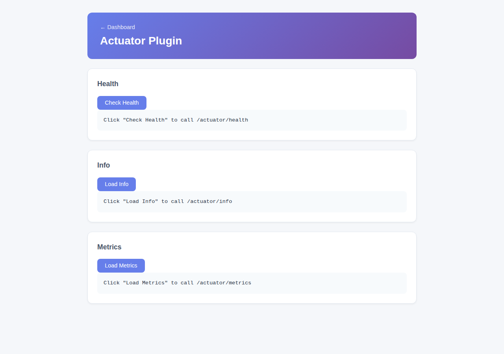

# Actuator Plugin

Exposes standard Spring Boot Actuator endpoints — health, metrics, and application info — for monitoring this Firefly instance.



## Install

```bash
cd plugins/actuator-plugin && mvn clean package
cp target/actuator-plugin-1.0.1-SNAPSHOT.jar ../../plugins/
```

## Configuration

Properties prefix: `firefly.plugin.actuator.*` (`enabled`, default `true`).

## Endpoints

| Endpoint | Description |
|---|---|
| `GET /actuator` | Discovery — links to every enabled Actuator endpoint |
| `GET /actuator/health` | Liveness/readiness status |
| `GET /actuator/info` | Application info (version, build) |
| `GET /actuator/metrics` | JVM/application metrics |
| `GET /pages/actuator` | Web UI — buttons to call health/info/metrics and inspect the raw response |

## Integration with the rest of the app

- The **dashboard** (`/`) fetches `/actuator` live and renders every discovered link, and flips its "Actuator Monitoring" status badge to *Installed* once this plugin is on the classpath.
- The **MCP plugin tree** (`/mcp-registry`, see [Model Context Protocol](/docs/mcp-server)) lists an `actuator-health-check` skill and an `actuator-http` server pointing at `/actuator`, via this plugin's bundled `META-INF/firefly/mcp-plugin.json`.
