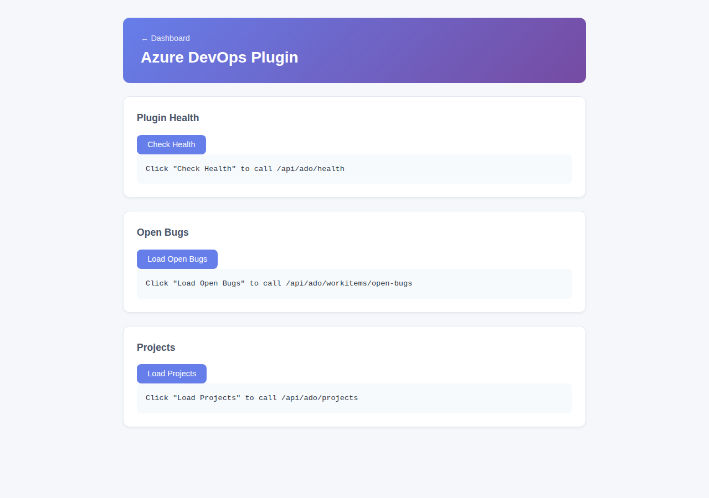

# Azure DevOps Plugin

Connects Firefly to Azure DevOps for work item management — query, create, and update work items via REST, backed by Azure DevOps' WIQL query API.



## Install

```bash
cd plugins/ado-plugin && mvn clean package
cp target/ado-plugin-1.0.1-SNAPSHOT.jar ../../plugins/
```

## Configuration

Properties prefix: `firefly.plugin.ado.*`:

```yaml
firefly:
  plugin:
    ado:
      enabled: true
      url: https://dev.azure.com/my-org
      project: my-project
      pat: ${ADO_PAT}
```

Or via environment variables (`ADO_ORG`, `ADO_PROJECT`, `ADO_PAT`). Without a PAT configured, the plugin still loads but `/api/ado/health` reports `disconnected`.

## Endpoints

| Endpoint | Description |
|---|---|
| `GET /api/ado/health` | Connection status (`connected`/`disconnected`) |
| `GET /api/ado/workitems/{id}` | Fetch one work item |
| `POST /api/ado/workitems/query` | Run a WIQL query |
| `GET /api/ado/workitems/open-bugs` | All open bugs |
| `GET /api/ado/workitems/tasks?user={name}` | Tasks assigned to a user |
| `PATCH /api/ado/workitems/{id}/field` \| `/fields` | Update one or more fields |
| `PATCH /api/ado/workitems/{id}/state` | Update work item state |
| `PATCH /api/ado/workitems/{id}/assign` | Reassign a work item |
| `POST /api/ado/workitems` \| `/tasks` \| `/bugs` | Create a generic work item, task, or bug |
| `GET /api/ado/projects` | List projects in the configured organization |
| `GET /pages/ado` | Web UI — health check, open bugs, project listing |

## Integration with the rest of the app

The **MCP plugin tree** (see [Model Context Protocol](/docs/mcp-server)) lists an `ado-work-item-query` skill and an `ado-http` server pointing at `/api/ado`, via this plugin's bundled `META-INF/firefly/mcp-plugin.json`.
