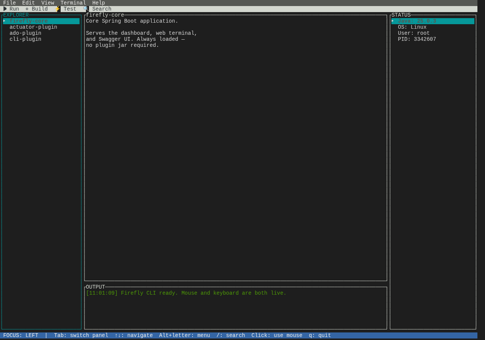

# CLI Plugin

A standalone terminal UI application built with **TamboUI** + **jline3** + **picocli** — not a Spring auto-config plugin like the others, but a self-contained fat JAR that the core app's web terminal launches as a child process.



## Install

```bash
cd plugins/cli-plugin && mvn clean package
cp target/cli-plugin-1.0.1-SNAPSHOT.jar ../../plugins/
```

## How it gets used

- **`TerminalService.findCliPluginJar()`** (core) scans the plugins directory for `cli-plugin*.jar`. If present, the web terminal (`/terminal`) launches it directly as the PTY's child process — that's the entire integration point, no Spring beans or REST endpoints involved.
- It can also be run directly: `java -jar plugins/cli-plugin-1.0.1-SNAPSHOT.jar`, or via `./target/firefly-*.jar --tui` from the core app (which locates and classloads the CLI plugin's main class at runtime).

## The TUI

A 3-panel interface: **Explorer** (left — browse installed components), **main content** (center), **status** (right), and **output/command history** (bottom, up to 200 lines). Menu bar (File/Edit/View), a RUN/BUILD/TEST/SEARCH toolbar, real-time search filtering, a dark-theme toggle, and full mouse support (click, drag, scroll). See [Web Terminal](/docs/terminal) for how the browser side connects to it.
