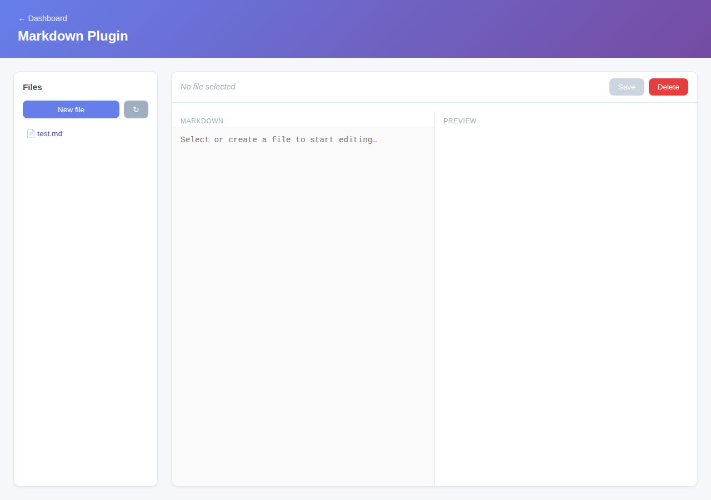

# Markdown Plugin

A fully functional Markdown file editor, scoped to a configured root directory, with a file tree, raw-source editing, and a live rendered preview.



## Install

```bash
cd plugins/markdown-plugin && mvn clean package
cp target/markdown-plugin-1.0.0-SNAPSHOT.jar ../../plugins/
```

## Configuration

Properties prefix: `firefly.plugin.markdown.*` — `enabled` (default `true`), `rootDir` (default `~/.firefly/markdown`, auto-created).

## Path safety

Every file operation resolves the caller's relative path against the configured root, normalizes it, and requires the result to stay under the root — then additionally resolves the *real* filesystem path of the nearest existing ancestor to catch symlink escapes. Any traversal attempt (`../`, absolute paths, a symlink pointing outside the root) is rejected with a `4xx` before touching the filesystem, never silently reinterpreted.

## Endpoints

| Endpoint | Description |
|---|---|
| `GET /api/markdown/files` | List `.md` files under the root (path, size, last-modified) |
| `GET /api/markdown/files/**` | Read one file's raw content |
| `PUT /api/markdown/files/**` | Create or overwrite a file (auto-creates parent directories) |
| `DELETE /api/markdown/files/**` | Delete a file |
| `POST /api/markdown/preview` | Raw markdown → rendered HTML (flexmark, CommonMark + GFM tables) |
| `GET /api/markdown/health` | `{"plugin":"markdown","status":"ok"}` |
| `GET /pages/markdown` | Web UI — file-tree sidebar, editor, debounced live preview, Save/New/Delete |

## Integration with the rest of the app

The **MCP plugin tree** (see [Model Context Protocol](/docs/mcp-server)) lists a `markdown-file-editing` skill and a `markdown-http` server pointing at `/api/markdown`.
