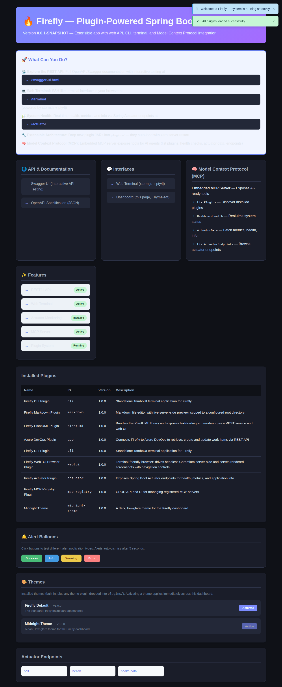

# Midnight Theme Plugin

A dark, low-glare theme for the Firefly dashboard — and the reference example for how simple a theme plugin can be: **no Java code at all**.



## Install

```bash
cd plugins/midnight-theme-plugin && mvn clean package
cp target/midnight-theme-plugin-1.0.0-SNAPSHOT.jar ../../plugins/
```

Then activate it from the dashboard's "🎨 Themes" card, or:

```bash
curl -X POST http://localhost:17922/api/theme/midnight-theme
```

## The entire plugin

Two resource files, nothing else:

- `META-INF/plugin.properties` — the usual id/name/version/author/description
- `META-INF/firefly/theme.css` — overrides the palette's CSS custom properties:

```css
:root {
    --firefly-bg: #0f1117;
    --firefly-surface: #1a1d29;
    --firefly-text: #e2e8f0;
    --firefly-accent: #7c8cff;
    --firefly-accent-2: #a56bff;
    /* ...and a few more, see the theming contract in Theme Manager */
}
```

See [Theme Manager](/docs/theme-manager) for how `ThemeManager` discovers this and why the CSS just works with zero template changes.
