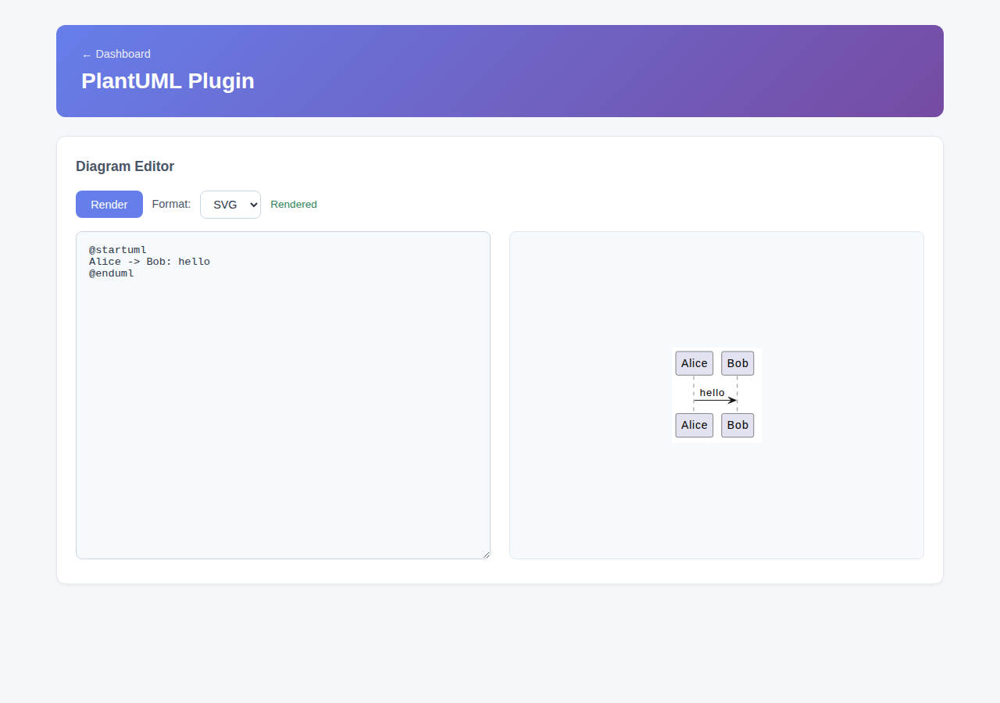
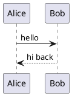

# PlantUML Plugin

Bundles the PlantUML library and renders diagram source to SVG/PNG — no external PlantUML or Graphviz install needed on the host.



## Install

```bash
cd plugins/plantuml-plugin && mvn clean package
cp target/plantuml-plugin-1.0.0-SNAPSHOT.jar ../../plugins/
```

## Configuration

Properties prefix: `firefly.plugin.plantuml.*`:

| Property | Default | Meaning |
|---|---|---|
| `enabled` | `true` | Master switch |
| `renderTimeoutSeconds` | `10` | Rendering runs on a bounded worker thread; a pathological diagram can't hang the request past this |
| `maxSourceLength` | `20000` | Reject longer input with `400` before attempting to render |

## Endpoints

| Endpoint | Description |
|---|---|
| `POST /api/plantuml/render?format=svg\|png` | Body = raw PlantUML source (`text/plain`); response = the rendered image with the matching content type |
| `GET /api/plantuml/health` | `{"plugin":"plantuml","status":"ok"}` |
| `GET /pages/plantuml` | Web UI — source textarea + debounced live preview |

Invalid or oversized input always returns a clean `400` JSON error (`{"error": "...", "status": 400}`) — never a stack trace.

## Example



```bash
curl -X POST "http://localhost:17922/api/plantuml/render?format=svg" \
  -H "Content-Type: text/plain" --data-binary @diagram.puml
```

## Integration with the rest of the app

The **MCP plugin tree** (see [Model Context Protocol](/docs/mcp-server)) lists a `plantuml-render` skill and a `plantuml-http` server pointing at `/api/plantuml/render`.
