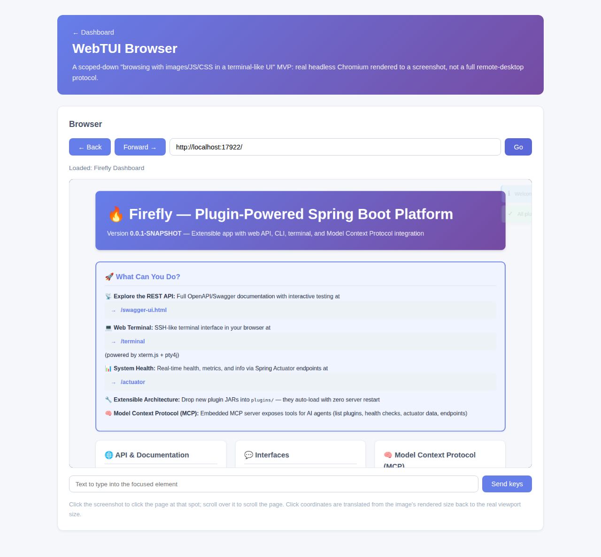

# WebTUI Browser Plugin

A modern take on the 80s-style terminal browser (lynx/w3m): rather than degrading to text/ANSI art the way real ttys must, this drives a real headless Chromium instance (Playwright) server-side with full JS/CSS execution, and serves the rendered page as an actual PNG screenshot — genuine image/CSS/JS-rendered browsing, not an approximation. A scoped-down single-shared-page MVP, not a full remote-desktop protocol.



## Install

```bash
cd plugins/webtui-plugin && mvn clean package
cp target/webtui-plugin-1.0.0-SNAPSHOT.jar ../../plugins/
```

## Configuration

Properties prefix: `firefly.plugin.webtui.*`:

| Property | Default |
|---|---|
| `enabled` | `true` |
| `homepage` | `https://example.com` |
| `viewportWidth` / `viewportHeight` | `1280` / `800` |
| `navigationTimeoutSeconds` | `15` |

## Graceful degradation

The auto-configuration is gated by `@ConditionalOnClass(Playwright.class)`, mirroring how the core web terminal only activates when `pty4j` is present. Even when Playwright *is* on the classpath, `BrowserSessionService` lazily launches headless Chromium on first use and, if that fails (e.g. the runtime image lacks Chromium's native shared libraries — not installed by default, to keep the core Docker image lean), every endpoint returns a clean `503` with `browserAvailable: false` instead of a stack trace or crash.

## Endpoints

| Endpoint | Description |
|---|---|
| `GET /api/webtui/health` | `{"plugin":"webtui","status":"ok","browserAvailable":bool}` |
| `POST /api/webtui/navigate` | `{"url": "..."}` |
| `GET /api/webtui/screenshot` | Current page as `image/png` |
| `POST /api/webtui/click` \| `/scroll` \| `/type` \| `/back` \| `/forward` | Drive the page |
| `GET /pages/webtui` | Web UI — URL bar, live screenshot (re-polled after each action), clicks/scroll/keys forwarded to the real page |

## Integration with the rest of the app

The **MCP plugin tree** (see [Model Context Protocol](/docs/mcp-server)) lists a `webtui-browse` skill and a `webtui-http` server pointing at `/api/webtui`.
