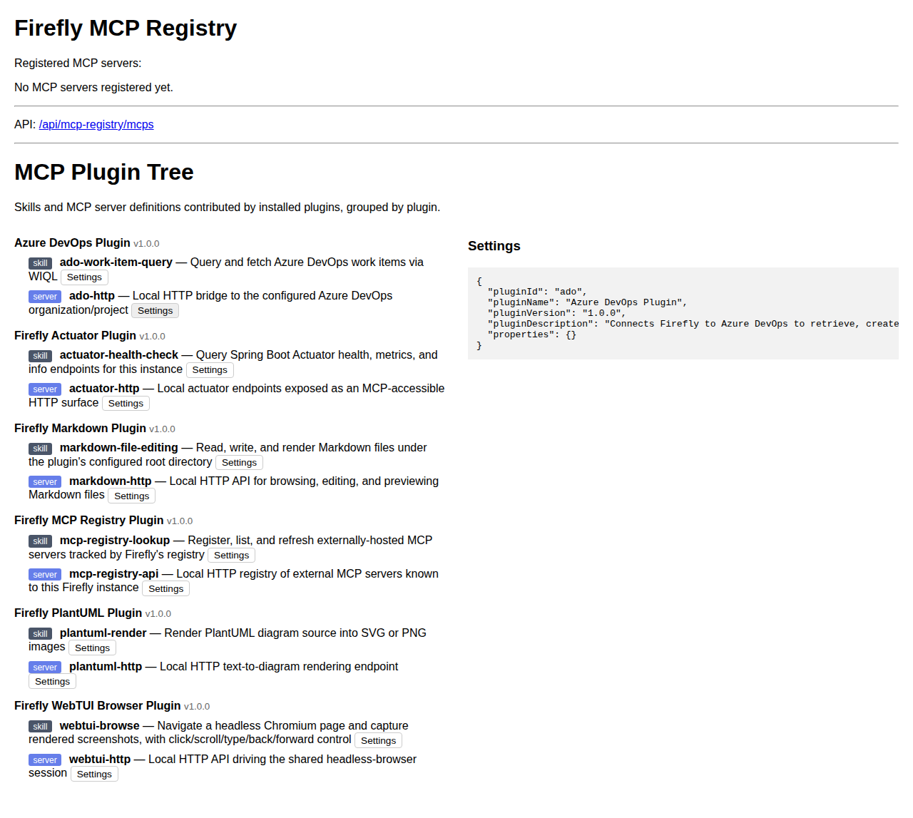

# Model Context Protocol (MCP)

Firefly exposes an MCP surface for AI agents in two layers: the embedded server itself, and a **plugin tree** that groups AI-usable capabilities by the plugin that provides them.



## The plugin tree

Any plugin JAR may bundle a `META-INF/firefly/mcp-plugin.json` manifest declaring the **skills** and/or **MCP server definitions** it contributes:

```json
{
  "skills": [
    {"name": "actuator-health-check", "description": "Query Spring Boot Actuator health, metrics, and info endpoints"}
  ],
  "servers": [
    {"name": "actuator-http", "type": "http", "target": "/actuator", "description": "Local actuator endpoints exposed as an MCP-accessible HTTP surface"}
  ]
}
```

`mcp-registry-plugin`'s `McpPluginTreeScanner` finds every plugin JAR with such a manifest (scanning the plugins directory the same way `DashboardService`/`ThemeManager`/`DocsManager` do for their own conventions), groups the declarations by owning plugin (id/name/version from that plugin's own `plugin.properties`), and exposes the result as a tree:

- `GET /api/mcp-registry/tree` — `[{pluginId, pluginName, pluginVersion, skills: [...], servers: [...]}, ...]`
- `GET /api/mcp-registry/tree/{pluginId}/config` — that plugin's resolved `firefly.plugin.<pluginId>.*` configuration, read live off the Spring `Environment` — values whose key contains `token`/`password`/`secret`/`pat`/`key`/`credential` are masked before being returned
- `/mcp-registry` — a web UI rendering the tree as expandable plugin groups, with a "Settings" button per skill/server that fetches and shows that plugin's config

Six of Firefly's plugins ship a manifest out of the box: `actuator`, `ado`, `mcp-registry` (self-describing), `plantuml`, `markdown`, and `webtui`.

## The external MCP registry

Separately, `mcp-registry-plugin` also lets you register *external* MCP servers Firefly should know about (not plugin-contributed ones) — `GET/POST /api/mcp-registry/mcps`, `GET/DELETE /api/mcp-registry/mcps/{id}`, persisted as JSON to `firefly.plugin.mcp-registry.store-path`. See the [MCP Registry Plugin](/docs/mcp-registry) docs for the full API.
