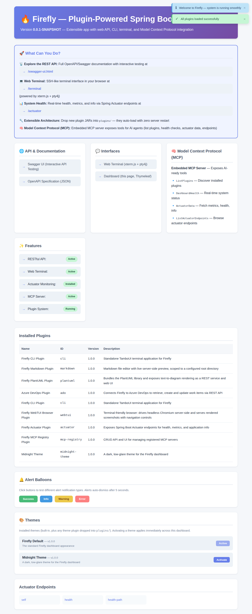

# Firefly

Firefly is a plugin-powered Spring Boot 4 platform. A small core (dashboard, web terminal, REST API, embedded MCP server, theme manager) stays always-on, and everything else — Actuator monitoring, Azure DevOps integration, a CLI/TUI, diagram rendering, a Markdown editor, a headless-browser terminal browser, and more — ships as independent plugin JARs that drop into a `plugins/` directory and load at runtime with **zero rebuild of the core app**.

## Core (always-on)

| Feature | What it does |
|---|---|
| **Web Dashboard** (`/`) | Lists installed plugins, links to every interface, shows Actuator endpoints if that plugin is loaded |
| **Web Terminal** (`/terminal`) | xterm.js in the browser, bridged over WebSocket to a real PTY (runs `cli-plugin`'s TUI if installed, a bare shell otherwise) |
| **REST API + Swagger** (`/swagger-ui.html`) | Full OpenAPI docs for every endpoint the core app and loaded plugins expose |
| **Embedded MCP surface** | See [Model Context Protocol](/docs/mcp-server) |
| **Theme Manager** | See [Theme Manager](/docs/theme-manager) |
| **Documentation Browser** (`/docs`, this page) | What you're reading right now — combines this page with every plugin's own bundled docs |

## Installed plugins

Open the **Plugins** section in the sidebar to browse each installed plugin's own documentation — every plugin that bundles a `META-INF/firefly/docs/index.md` in its JAR shows up there automatically, with no changes needed to this core app. That's the same mechanism used for the plugin tree in the [MCP Registry Plugin](/docs/mcp-registry) and for [theme plugins](/docs/theme-manager) — Firefly's plugin system now has three composable conventions:

1. `META-INF/plugin.properties` — identity (id/name/version/description/author), read by the dashboard's plugin table
2. `META-INF/firefly/mcp-plugin.json` — skills/MCP servers the plugin contributes, grouped into the [MCP tree](/docs/mcp-server)
3. `META-INF/firefly/docs/` — the plugin's own documentation (`index.md` + a `screenshots/` folder), aggregated into this Documentation Browser (see [MCP Registry Plugin](/docs/mcp-registry) for an example)

A plugin can adopt any subset of these — none are required, all are additive.

## Where to go next

- **Build/run instructions**: see the repository's `AGENTS.md` (agent-oriented) or `README.md` (human-oriented) — this in-app browser covers *what things do and how to use them*, those files cover *how to build and deploy them*.
- **Architecture diagrams**: `docs/ARCHITECTURE.md` and `docs/MCP-ARCHITECTURE.md` in the repository root.
